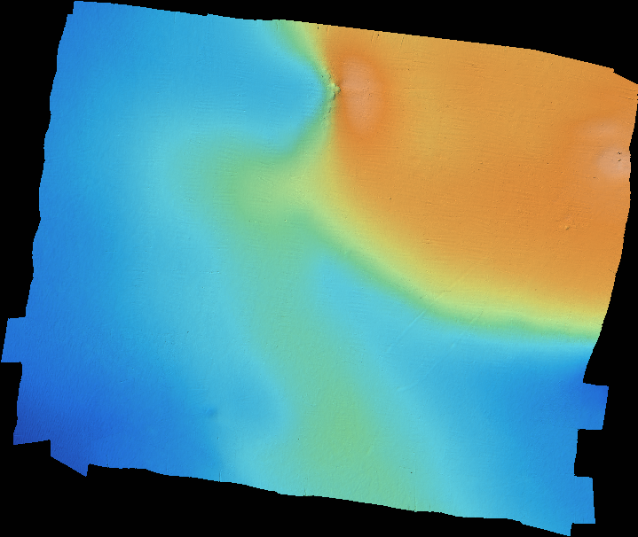

# Create_Raster

Programme qui permet de générer une image 2D représentant, par niveau de couleurs, les différentes altitudes d'un terrain 2.5D.


# Requirements

- Proj 9.1.1

# Démarrage

Une fois le dossier récupéré, executer le `./build.sh` puis ouvrir le dossier build dans un terminal.

## Exécuter le programme

Pour exécuter le programme, lancer la commande dans le dossier build :
`./create_rester <file> <img_width>`

## Fichier d'entrée

Le format du fichier d'entrée doit être de la forme latitude, longitude et hauteur tel que
```
48.29762887 -004.41737340 14.334
48.29762971 -004.41735997 14.379
...
```
NB : Le fichier ne doit pas avoir de ligne vide à la fin
## Fichier de sortie
Se trouve dans le dossier build avec comme nom `<nom_fichier_entree>.ppm`.
C'est une image de type PPM codé en binaire.

# Note
> Written with [StackEdit](https://stackedit.io/).